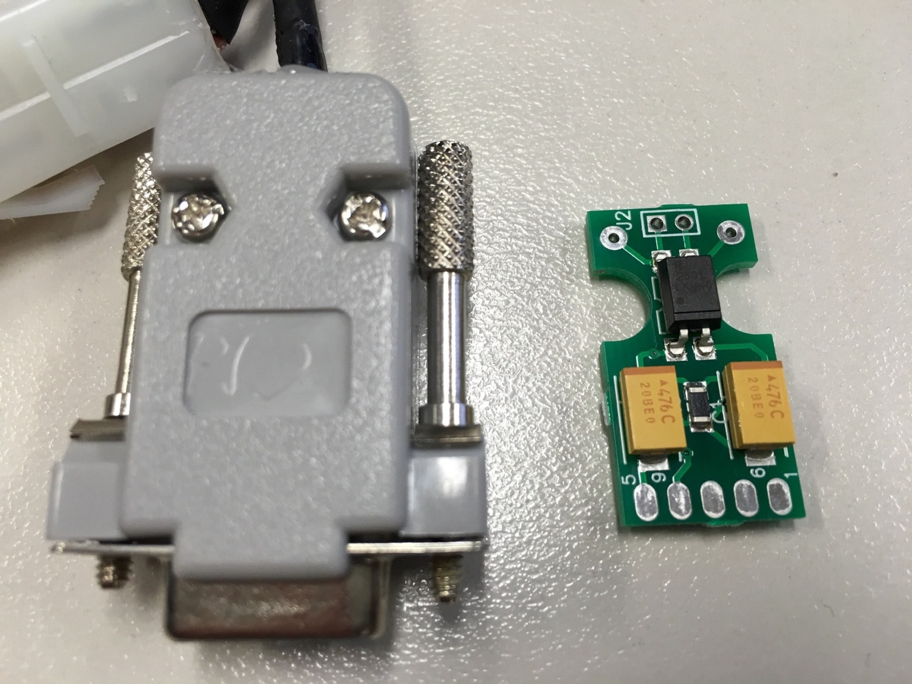
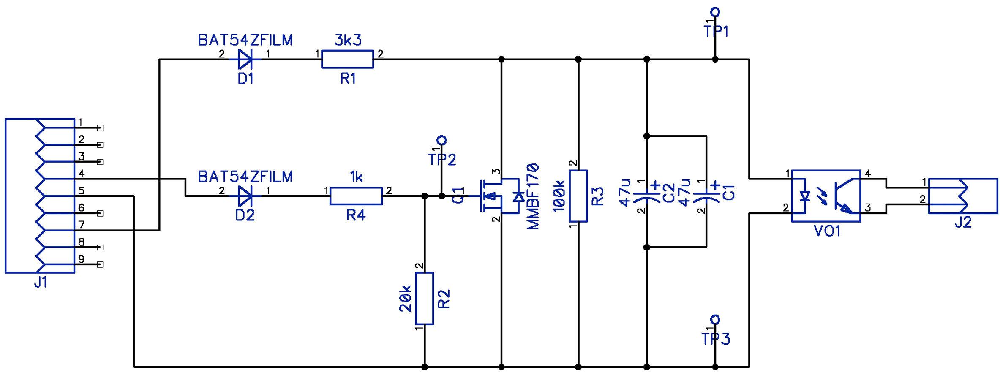

## Fencing agent for rcd_serial devices and pacemaker

As seen on [hackaday.io](https://hackaday.io/project/159156-serial-stonith-power-fencing-device-for-clusters)

### A Linux Cluster Base STONITH provider for use with modern Pacemaker clusters.

This has since been accepted and merged into Fedora's code base and as such will make it's way to RHEL.

- Device: https://smcleod.net/rcd-stonith/ (Warning: Contains somewhat outaged images / diagrams now)
- I have open sourced the CAD circuit design and made this available within this repo under 
[CAD Design and Schematics](CAD/STONTH_CAD_DESIGN_V3)
- [DipTrace CAD Software](http://diptrace.com/download-diptrace/mac-install/)
- Related RedHat Bug: https://bugzilla.redhat.com/show_bug.cgi?id=1240868

Many thanks to:

- OurPCB (Board Production).
- Clusterlabs, Redhat and Fedora Teams.
- John Sutton for his [original design](http://www.init.hr/dev/cluster/glue/lib/plugins/stonith/rcd_serial.c) that served as inspiration.

